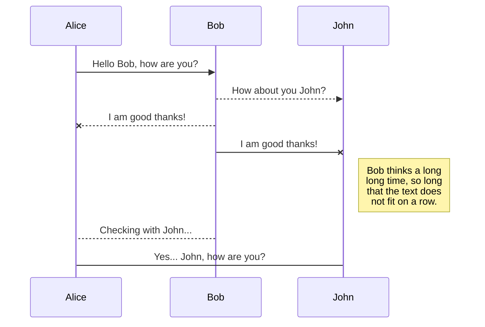
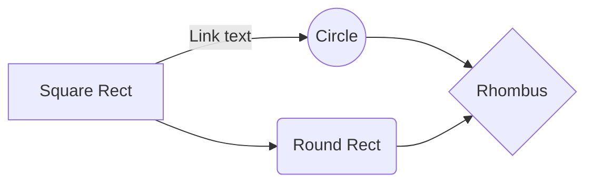

# Présentation du sujet
Mon nom est Victorien Blanchard et voici mon rapport de veille cyber concernant le reverse engineering, et probablement à posteriori l'exploitation de binaire via l'étude de failles du type Buffer Overflow.
Mon premier sujet d'étude sera donc naturellement le reverse et l'analyse de code assembleur, afin d'avoir les bases nécessaires pour attaquer l'exploitation de binaire.

# REVERSE

Dans un premier temps je m'interesse à l'architecture x86, soit l'architecture 32bits d'intel.
Il existe de nombreuses autres architectures, dont les plus connues sont : 

 - x86-64 (Architecture 64bits intel)
 - ARM
 - MISP

## Composition d'un programme

Un programme fonctionne grâce à deux parties essentielles : le processeur et la mémoire. Avant de voir comment un le processeur execute un programme, il faut analyser comment est gérée la mémoire. 
Il est important de constater que la mémoire est répartie en pluieurs segments qui ont chacunes un rôle propre.
Parmi celles qui vont le plus nous intéresser : 

 - .text (Où sera situé les instructions du programme, notre "code")
 - .bss (Où seront stockées les variables globales non initialisées)
 - .data (Où seront stockées les variables globales initialisées)
 - .got et .plt (Où sont stockées les adresses de fontions de la libC lorsque compilées dynamiquement)

Voici un example avec un programme tout simple expliquant les différentes sections :

```C
#include <stdio.h>
#include <stdlib.h>
//.text section from here    
char* strBss = "Hello from bss!"; //initialised -> .data section
int variable; //Not initialised -> .bss section
    
void hello(char* str){
    printf("%s\n", str);
}
    
int main(char** argv, int argc){
    char* str = "Hello from the stack!"; //Will be pushed to Stack
    char* strFromHeap = malloc(sizeof(char) * 21); //Allocated on Heap
    sprintf(strFromHeap, "Hello from the Heap!");
    hello(str);
    free(strFromHeap); //Always free() dynamically allocated var
    return 1;
}
//end of .text section 
```
En réalité, la section .text sera bien plus grande que simplement nos quelques lignes de code transformées en assembleur. En effet par exemple lorsque l'executable sera compilé avec gcc en temps qu'executable linux 32bits (ELF32), des instructions seront ajoutées au début et après le programme que l'on a écrit. Il est intéressant de remarquer que la première fonction executée n'est pas la fonction `main()` , mais la fonction `_start()`, qui préparera elle même les arguments pour `_libc_start_main()`, qui préparera les arguments pour la fonction `init()`, qui appelera la fonction `main()` . Les arguments préparés seront les fameux ARGV, ARGC, et ENV, une variable permettant de récupérer les variables d'environnement depuis le programme.

>Le "entry point" (l'adresse écrite dans le header du fichier et qui définit l'adresse de la première instruction à executer) pointe vers la fonction `_start()`.

Ces fonctions sont d'ailleurs évidemment observables via `objdump --disassemble  notreProgamme`, qui va entièrement désassembler notre executable.

Une autre partie très importante de la mémoire est une partie qui est gérée pendant l'execution du progamme, contrairement aux sections montrées précédemment.
Il s'agit de la pile (la fameuse "Stack") et le tas ("Heap").

### Le Heap
Dans le heap seront stockées toutes les variables allouées dynamiquement par des fonctions du type `malloc()`, `calloc()`, ou encore `realloc()` (pour les fonctions les plus communes). Ces variables son allouées pendant l'execution du programme et sont stockées dans le Heap. Il est intéressant de constater que le Heap contient également le contenu de ENV (et donc tous les chemins des variables d'environnement).

### La Stack

Lors de l'execution du progamme, les arguments seront "push" sur la stack, c'est à dire qu'il seront placé en haut de la pile, au dessus du dernier élément (la pile est dite "LIFO", Last In First Out). On va donc empiler des éléments sur la stack, et les dépiler lorsque l'on en aura besoin.

### En bref
Voici un schéma qui résume bien la mémoire dans un programme en plus de donner la localisation de chaque segment dans la mémoire  :

```C
#include <stdio.h>
#include <stdlib.h>
//.text section from here    
char* strBss = "Hello from bss!"; //initialised -> .data section
int variable; //Not initialised -> .bss section
    
void hello(char* str){
    printf("%s\n", str);
}
    
int main(char** argv, int argc){
    char* str = "Hello from the stack!"; //Will be pushed to Stack
    char* strFromHeap = malloc(sizeof(char) * 21); //Allocated on Heap
    sprintf(strFromHeap, "Hello from the Heap!");
    hello(str); //sr is beeing pushed to the stack
    free(strFromHeap); //Always free() dynamically allocated var
    return 1;
}
//end of .text section 
```
Représentation de la pile avant l'appel à la fonction `hello()` :
|Some values| ESP |
|--|--|
| XXXXXXX |  |
|XXXXXXX


## Create files and folders

The file explorer is accessible using the button in left corner of the navigation bar. You can create a new file by clicking the **New file** button in the file explorer. You can also create folders by clicking the **New folder** button.

## Switch to another file

All your files are listed in the file explorer. You can switch from one to another by clicking a file in the list.

## Rename a file

You can rename the current file by clicking the file name in the navigation bar or by clicking the **Rename** button in the file explorer.

## Delete a file

You can delete the current file by clicking the **Remove** button in the file explorer. The file will be moved into the **Trash** folder and automatically deleted after 7 days of inactivity.

## Export a file

You can export the current file by clicking **Export to disk** in the menu. You can choose to export the file as plain Markdown, as HTML using a Handlebars template or as a PDF.


# Synchronization

Synchronization is one of the biggest features of StackEdit. It enables you to synchronize any file in your workspace with other files stored in your **Google Drive**, your **Dropbox** and your **GitHub** accounts. This allows you to keep writing on other devices, collaborate with people you share the file with, integrate easily into your workflow... The synchronization mechanism takes place every minute in the background, downloading, merging, and uploading file modifications.

There are two types of synchronization and they can complement each other:

- The workspace synchronization will sync all your files, folders and settings automatically. This will allow you to fetch your workspace on any other device.
	> To start syncing your workspace, just sign in with Google in the menu.

- The file synchronization will keep one file of the workspace synced with one or multiple files in **Google Drive**, **Dropbox** or **GitHub**.
	> Before starting to sync files, you must link an account in the **Synchronize** sub-menu.

## Open a file

You can open a file from **Google Drive**, **Dropbox** or **GitHub** by opening the **Synchronize** sub-menu and clicking **Open from**. Once opened in the workspace, any modification in the file will be automatically synced.

## Save a file

You can save any file of the workspace to **Google Drive**, **Dropbox** or **GitHub** by opening the **Synchronize** sub-menu and clicking **Save on**. Even if a file in the workspace is already synced, you can save it to another location. StackEdit can sync one file with multiple locations and accounts.

## Synchronize a file

Once your file is linked to a synchronized location, StackEdit will periodically synchronize it by downloading/uploading any modification. A merge will be performed if necessary and conflicts will be resolved.

If you just have modified your file and you want to force syncing, click the **Synchronize now** button in the navigation bar.

> **Note:** The **Synchronize now** button is disabled if you have no file to synchronize.

## Manage file synchronization

Since one file can be synced with multiple locations, you can list and manage synchronized locations by clicking **File synchronization** in the **Synchronize** sub-menu. This allows you to list and remove synchronized locations that are linked to your file.


# Publication

Publishing in StackEdit makes it simple for you to publish online your files. Once you're happy with a file, you can publish it to different hosting platforms like **Blogger**, **Dropbox**, **Gist**, **GitHub**, **Google Drive**, **WordPress** and **Zendesk**. With [Handlebars templates](http://handlebarsjs.com/), you have full control over what you export.

> Before starting to publish, you must link an account in the **Publish** sub-menu.

## Publish a File

You can publish your file by opening the **Publish** sub-menu and by clicking **Publish to**. For some locations, you can choose between the following formats:

- Markdown: publish the Markdown text on a website that can interpret it (**GitHub** for instance),
- HTML: publish the file converted to HTML via a Handlebars template (on a blog for example).

## Update a publication

After publishing, StackEdit keeps your file linked to that publication which makes it easy for you to re-publish it. Once you have modified your file and you want to update your publication, click on the **Publish now** button in the navigation bar.

> **Note:** The **Publish now** button is disabled if your file has not been published yet.

## Manage file publication

Since one file can be published to multiple locations, you can list and manage publish locations by clicking **File publication** in the **Publish** sub-menu. This allows you to list and remove publication locations that are linked to your file.


# Markdown extensions

StackEdit extends the standard Markdown syntax by adding extra **Markdown extensions**, providing you with some nice features.

> **ProTip:** You can disable any **Markdown extension** in the **File properties** dialog.


## SmartyPants

SmartyPants converts ASCII punctuation characters into "smart" typographic punctuation HTML entities. For example:

|                |ASCII                          |HTML                         |
|----------------|-------------------------------|-----------------------------|
|Single backticks|`'Isn't this fun?'`            |'Isn't this fun?'            |
|Quotes          |`"Isn't this fun?"`            |"Isn't this fun?"            |
|Dashes          |`-- is en-dash, --- is em-dash`|-- is en-dash, --- is em-dash|


## KaTeX

You can render LaTeX mathematical expressions using [KaTeX](https://khan.github.io/KaTeX/):

The *Gamma function* satisfying $\Gamma(n) = (n-1)!\quad\forall n\in\mathbb N$ is via the Euler integral

$$
\Gamma(z) = \int_0^\infty t^{z-1}e^{-t}dt\,.
$$

> You can find more information about **LaTeX** mathematical expressions [here](http://meta.math.stackexchange.com/questions/5020/mathjax-basic-tutorial-and-quick-reference).


## UML diagrams

You can render UML diagrams using [Mermaid](https://mermaidjs.github.io/). For example, this will produce a sequence diagram:



And this will produce a flow chart:


<!--stackedit_data:
eyJoaXN0b3J5IjpbLTEzNTcxMTc3ODgsLTc1MTA0MjkyNiwtMT
E0OTc5NDMwOF19
-->