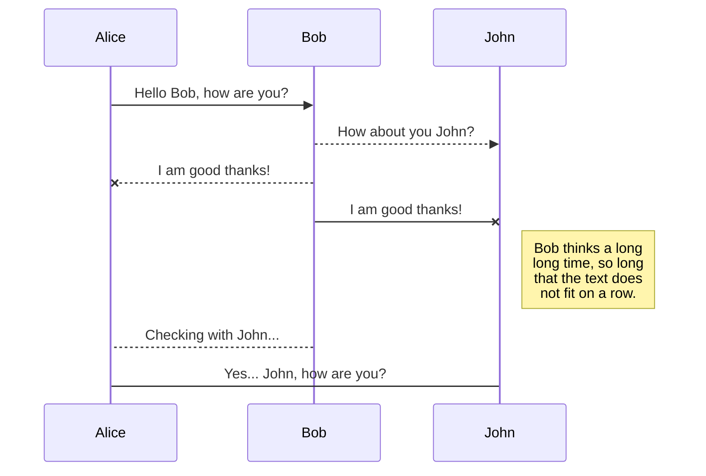
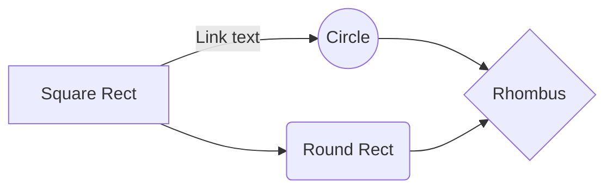

# Présentation du sujet
Mon nom est Victorien Blanchard et voici mon rapport de veille cyber concernant le reverse engineering, et probablement à posteriori l'exploitation de binaire via l'étude de failles du type Buffer Overflow.
Mon premier sujet d'étude sera donc naturellement le reverse et l'analyse de code assembleur, afin d'avoir les bases nécessaires pour attaquer l'exploitation de binaire.

# REVERSE

Dans un premier temps je m'interesse à l'architecture x86, soit l'architecture 32bits d'intel.
Il existe de nombreuses autres architectures, dont les plus connues sont : 

 - x86-64 (Architecture 64bits intel)
 - ARM
 - MISP

## Composition d'un programme

Un programme fonctionne grâce à deux parties essentielles : le processeur et la mémoire. Avant de voir comment un le processeur execute un programme, il faut analyser comment est gérée la mémoire. 
Il est important de constater que la mémoire est répartie en pluieurs segments qui ont chacunes un rôle propre.
Parmi celles qui vont le plus nous intéresser : 

 - .text (Où sera situé les instructions du programme, notre "code")
 - .bss (Où seront stockées les variables globales non initialisées)
 - .data (Où seront stockées les variables globales initialisées)
 - .got et .plt (Où sont stockées les adresses de fontions de la libC lorsque compilées dynamiquement)

Voici un example avec un programme tout simple expliquant les différentes sections :

```C
#include <stdio.h>
#include <stdlib.h>
//.text section from here    
char* strBss = "Hello from bss!"; //initialised -> .data section
int variable; //Not initialised -> .bss section
    
void hello(char* str){
    printf("%s\n", str);
}
    
int main(char** argv, int argc){
    char* str = "Hello from the stack!"; //Will be pushed to Stack
    char* strFromHeap = malloc(sizeof(char) * 21); //Allocated on Heap
    sprintf(strFromHeap, "Hello from the Heap!");
    hello(str);
    free(strFromHeap); //Always free() dynamically allocated var
    return 1;
}
//end of .text section 
```
En réalité, la section .text sera bien plus grande que simplement nos quelques lignes de code transformées en assembleur. En effet par exemple lorsque l'executable sera compilé avec gcc en temps qu'executable linux 32bits (ELF32), des instructions seront ajoutées au début et après le programme que l'on a écrit. Il est intéressant de remarquer que la première fonction executée n'est pas la fonction `main()` , mais la fonction `_start()`, qui préparera elle même les arguments pour `_libc_start_main()`, qui préparera les arguments pour la fonction `init()`, qui appelera la fonction `main()` . Les arguments préparés seront les fameux ARGV, ARGC, et ENV, une variable permettant de récupérer les variables d'environnement depuis le programme.

>Le "entry point" (l'adresse écrite dans le header du fichier et qui définit l'adresse de la première instruction à executer) pointe vers la fonction `_start()`.

Ces fonctions sont d'ailleurs évidemment observables via `objdump --disassemble  notreProgamme`, qui va entièrement désassembler notre executable.

Une autre partie très importante de la mémoire est une partie qui est gérée pendant l'execution du progamme, contrairement aux sections montrées précédemment.
Il s'agit de la pile (la fameuse "Stack") et le tas ("Heap").

### Le Heap
Dans le heap seront stockées toutes les variables allouées dynamiquement par des fonctions du type `malloc()`, `calloc()`, ou encore `realloc()` (pour les fonctions les plus communes). Ces variables son allouées pendant l'execution du programme et sont stockées dans le Heap. Il est intéressant de constater que le Heap contient également le contenu de ENV (et donc tous les chemins des variables d'environnement).

### La Stack

Lors de l'execution de fonctions dans le programme, les arguments seront "push" sur la stack, c'est à dire qu'il seront placé en haut de la pile, au dessus du dernier élément (la pile est dite "LIFO", Last In First Out). On va donc empiler des éléments sur la stack, et les dépiler lorsque l'on en aura besoin.

### Récap de la mémore avec un schéma + code
Voici un schéma qui résume bien la mémoire dans un programme en plus de donner la localisation de chaque segment dans la mémoire  :

```C
#include <stdio.h>
#include <stdlib.h>
//.text section from here    
char* strBss = "Hello from bss!"; //initialised -> .data section
int variable; //Not initialised -> .bss section
    
void hello(char* str){
    printf("%s\n", str);
}
    
int main(char** argv, int argc){
    char* str = "Hello from the stack!"; //Will be pushed to Stack
    char* strFromHeap = malloc(sizeof(char) * 21); //Allocated on Heap
    sprintf(strFromHeap, "Hello from the Heap!");
    hello(str); //sr is beeing pushed to the stack
    free(strFromHeap); //Always free() dynamically allocated var
    return 1;
}
//end of .text section 
```

## Les appels de fonction

Reprenons notre fonction `hello()` d'exemple : 

```C
#include <stdio.h>
void hello(char* str){
    printf("%s\n", str);
}

int main(void){
    char* str = "Hello";
    hello(str);
    return 0;
}
```
Et analysons ce qu'il se passe lors de l'appel de la foncton `hello()`.

Représentation de la pile avant l'appel à la fonction `hello()` :
|Some values|ESP|
|----|----|
| XXXXXXX |  |
|XXXXXXX | |
|   ... | |
|XXXXXXX | |
|__Bottom of the stack__ | __EBP__ |

A la ligne `hello(str);` :

|char* str| ESP |
|-----|------|
|Some values||
|XXXXXXX||
|XXXXXXX||
|...||
|XXXXXXX||
|Bottom of the stack|EBP|

|qwe w|qw|
|-----|------|
|qe||
|qwe|qwe| 


## SmartyPants

SmartyPants converts ASCII punctuation characters into "smart" typographic punctuation HTML entities. For example:

|                |ASCII                          |HTML                         |
|----------------|-------------------------------|-----------------------------|
|Single backticks|`'Isn't this fun?'`            |'Isn't this fun?'            |
|Quotes          |`"Isn't this fun?"`            |"Isn't this fun?"            |
|Dashes          |`-- is en-dash, --- is em-dash`|-- is en-dash, --- is em-dash|


## KaTeX

You can render LaTeX mathematical expressions using [KaTeX](https://khan.github.io/KaTeX/):

The *Gamma function* satisfying $\Gamma(n) = (n-1)!\quad\forall n\in\mathbb N$ is via the Euler integral

$$
\Gamma(z) = \int_0^\infty t^{z-1}e^{-t}dt\,.
$$

> You can find more information about **LaTeX** mathematical expressions [here](http://meta.math.stackexchange.com/questions/5020/mathjax-basic-tutorial-and-quick-reference).


## UML diagrams

You can render UML diagrams using [Mermaid](https://mermaidjs.github.io/). For example, this will produce a sequence diagram:



And this will produce a flow chart:


<!--stackedit_data:
eyJoaXN0b3J5IjpbNTIzNjc0ODAzLC03NzIwODkwODMsNDEwMj
QxMzMwLDk4MDA3MTA5NiwtNzUxMDQyOTI2LC0xMTQ5Nzk0MzA4
XX0=
-->